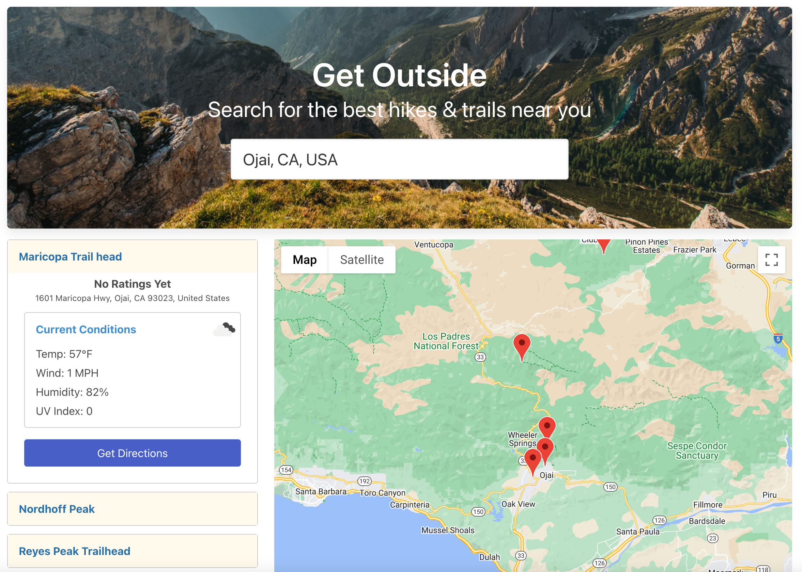

# Get Outside

A UW Coding Bootcamp project by Patrick, Furhan, Jawid, ZhenTian, and Jackson.

# Concept

Get Outside allows you to quickly and easily find hikes and trails near *anywhere* you might be.

## Motivation
To help users get new ideas for outdoor activities in their area. As developers, we wanted to learn new APIs and how to utilize the API data.

## User Story
AS a coder who sits at my computer coding all day and night, I WANT to enter a location and receive ideas for *where* to go for some fresh air and exercise PLUS details about each location to help me make a decision.

## Technologies
HTML, CSS (Bulma Framework), JS, Google Places API, OpenWeatherMap API

## Future Development Ideas
- Put more time into design and mobile version
- Make visual connection between markers and items on list
- Make results list an accordion
- Add pagination to list
- Add search button
- Add star rating to accordion header next to name, add star icon (using font-awesome)
- Use google's elevation api to get hike elevation
- Adding a hike to a favorites list (using local storage)
- Use Unsplash API for images

